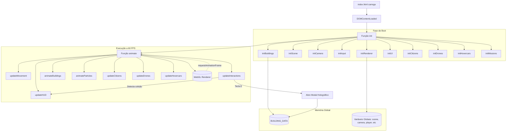

# Arquitetura e Diagrama de Implementação

Este documento apresenta a arquitetura geral do projeto **Cidade Front-End 2077**. O projeto foi construído utilizando **Three.js** sem o uso de bundlers (Webpack/Vite), operando perfeitamente via protocolo estático (`file://`).

## 🏗️ Visão Geral

O projeto está dividido entre o arquivo principal (`index.html`), que contém a UI, a declaração de dados pedagógicos e o Game Loop central, e scripts modulares (como `citizens.js` e `hovercars.js`) que anexam comportamentos à cena global gerenciada pelo Three.js.

> [!NOTE]
> A arquitetura prioriza facilidade de execução local sem configuração (zero-config). Todas as variáveis de estado de jogo (como câmera, posições e controles) são expostas globalmente para que os scripts adjacentes possam ler e escrever nelas.

---

## 📊 Diagrama de Arquitetura

O diagrama abaixo mapeia a inicialização e o fluxo do Game Loop.

---

## 📂 Organização dos Módulos

### 1. `index.html` (Motor Central)
Responsável por orquestrar todo o projeto.
- **BUILDING_DATA**: Dicionário gigantesco onde residem os textos pedagógicos (HTML, CSS, JS, etc.).
- **initScene() & initBuildings()**: Instanciam a neblina volumétrica (`FogExp2`), chãos, grid e toda a modelagem manual 3D usando primitivas.
- **updateMovement()**: Calcula colisões em caixa simplificada contra os prédios.

### 2. `citizens.js` (IA e NPCs)
- **Função**: Gera e movimenta de forma autônoma robôs/cidadãos pelos limites da cidade.
- **Lógica**: Utiliza vetores e contadores de tempo randômicos (`c.timer`) para escolher direções em eixos 2D (X e Z).

### 3. `hovercars.js` (Vida Aérea)
- **Função**: Controla a física dos ônibus voadores neon que cortam os céus.
- **Lógica**: Posiciona os carros estritamente em malhas predefinidas (`randomGridPos` múltiplo de 45), para simular que voam por cima das "ruas". Utiliza `PointLight` que desce em direção ao chão para criar sombreamento dramático.

### 4. Interface (DOM e CSS)
- **HUD**: Atualizado quadro a quadro pelas variáveis do player no Three.js (Coordenadas X/Z, frames por segundo e o mini-mapa renderizado num `<canvas>` 2D secundário).
- **#hologram**: Modal com estrutura DOM normal e tipografia Cyberpunk, que capta os dados de `BUILDING_DATA` e cria iterativamente o scroll de cartões informativos.

> [!TIP]
> Se quiser adicionar um novo prédio ou bloco, modifique a função `initBuildings` no *index.html* passando a propriedade `content` apontando para sua nova chave em `BUILDING_DATA`. A colisão e a exibição pedagógica serão feitas automaticamente!
